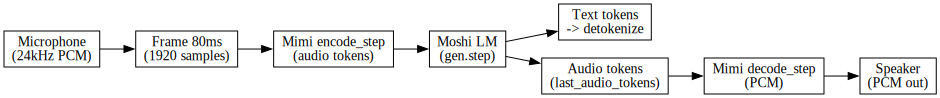
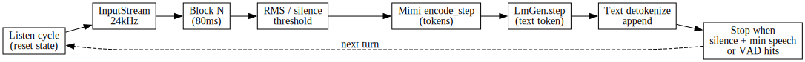
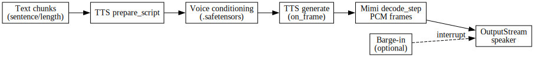
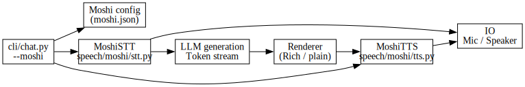

# DeepWiki Moshi Notes

**Created**: 2026-01-17
**Updated**: 2026-01-17

Notes distilled from the Kyutai-labs Moshi DeepWiki to guide MLX-Harmony integration, tuning, and performance work.

## Sources

Primary DeepWiki references:

- [DeepWiki Overview](https://deepwiki.com/kyutai-labs/moshi/1-overview)
- [Streaming Inference Pipeline](https://deepwiki.com/kyutai-labs/moshi/2.3-streaming-inference-pipeline)
- [Text-to-Speech System](https://deepwiki.com/kyutai-labs/moshi/4.4-text-to-speech-system)
- [MLX Implementation](https://deepwiki.com/kyutai-labs/moshi/5-mlx-implementation)
- [Audio Processing](https://deepwiki.com/kyutai-labs/moshi/7-audio-processing)
- [Streaming Architecture](https://deepwiki.com/kyutai-labs/moshi/7.2-streaming-architecture)

## High-Level Architecture

- Moshi is a real-time voice AI system built around two components: Mimi (audio codec) and Moshi (language model). Mimi encodes 24 kHz audio into a low-rate 12.5 Hz token stream; Moshi consumes those tokens and produces both text tokens and audio tokens (dual stream generation).
- The system is designed for full-duplex conversations, with the model processing user audio and generating its own audio simultaneously.
- The MLX implementation is optimized for Apple Silicon, supports quantized weights (4-bit and 8-bit), and relies on `rustymimi` for audio tokenization.

## Streaming Pipeline (Key Values)

- Audio is processed in **80 ms frames** which equals **1920 samples at 24 kHz**.
- Streaming uses stateful modules:
  - `StreamingModule.streaming()` / `streaming_forever()` context managers
  - `reset_streaming()` to clear internal state
  - `set_exec_mask()` to control desynchronized batch execution
- The loop structure is:
  1. Frame extraction (1920 samples)
  2. `encode_step()` (audio tokens)
  3. `lm_gen.step()` (text + audio tokens)
  4. `last_audio_tokens()` (get generated audio tokens)
  5. `decode_step()` (reconstruct audio)

## MLX Inference Flow (Reference)

- The MLX `run_inference.py` pipeline does:
  - `audio_tokenizer.encode_step(pcm_data)`
  - `gen.step(other_audio_tokens, ct)`
  - `gen.last_audio_tokens()` then `audio_tokenizer.decode_step()`
- The chunk size and timing are tightly linked to the Mimi frame rate (12.5 Hz) and 24 kHz sample rate.

## TTS Notes (DSM + Voice Conditioning)

- Moshi TTS uses **Delayed Streams Modeling (DSM)** with a streaming generation flow.
- Text preprocessing includes quote normalization, colon handling, parentheses removal, and SSML break tags.
- Voice conditioning uses `.safetensors` embeddings with a fixed shape + mask layout.

## Streaming Architecture Notes

- Streaming modules keep internal state (convs, transformers, codec states).
- The LM uses **acoustic delay** handling, which depends on correct token timing and stream alignment.
- Execution masks allow different batch streams to advance at different rates while maintaining efficiency.

## Practical Implications for MLX-Harmony

- **STT block size** should align with 80 ms @ 24 kHz (1920 samples).
- **Streaming state reset** should be explicit for each listen cycle to avoid stale audio bleed.
- **Token shape alignment** is critical; ensure `encode_step()` and `gen.step()` agree on expected batch + codebook axes.
- **Low-latency settings** depend on strict frame alignment and minimal buffering.
- **TTS voice embeddings** should be `.safetensors` files, not `.wav` clips.

## Potential Follow-Ups

- Audit `MoshiSTT.listen_once()` and ensure its block size and sample rate match 24 kHz / 80 ms frames.
- Consider a streaming mode that mimics `streaming_forever()` semantics to avoid repeated warmups.
- Use `hotmic` to tune `stt_silence_threshold` and `stt_silence_ms`, then map those values into Moshi config.

## Action Items

- [ ] Align Moshi STT input to 24 kHz with 80 ms blocks (1920 samples), and make sure `block_ms` defaults match this.
- [ ] Verify `encode_step()` → `gen.step()` token shape expectations against MLX reference pipeline.
- [ ] Ensure streaming state reset is explicit between listen cycles to prevent buffered audio bleed.
- [ ] Compare TTS chunking against Mimi frame timing to reduce stutter (avoid splitting mid-phoneme).
- [ ] Validate voice embedding `.safetensors` usage and document how to pick voices.
- [ ] Evaluate parallel STT + TTS architecture with non-speech filtering to avoid false barge-ins.
- [ ] Add a small “tuning checklist” mapping `hotmic` values to Moshi STT config.

## Diagrams

End-to-end overview:

STT listen loop:

TTS streaming:

Voice architecture:

Source `.dot` files:

- [Moshi End-to-End Flow (dot)](./diagrams/moshi_end_to_end.dot)
- [Moshi STT Listen Loop (dot)](./diagrams/moshi_stt_loop.dot)
- [Moshi TTS Streaming (dot)](./diagrams/moshi_tts_stream.dot)
- [Moshi Voice Architecture (dot)](./diagrams/moshi_voice_arch.dot)
